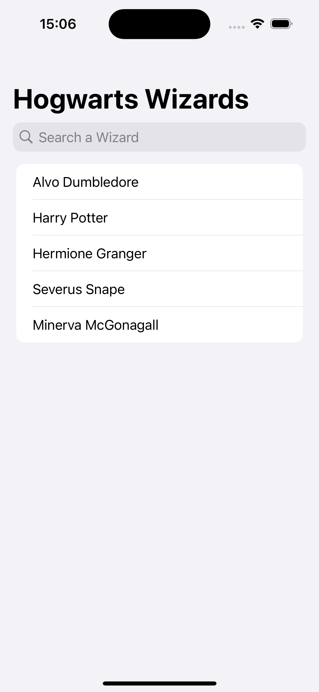
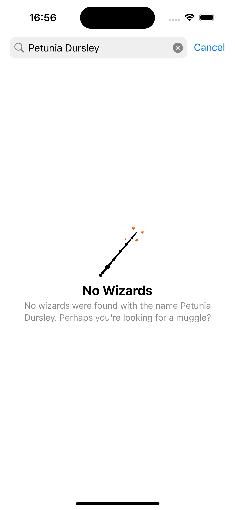

# Search Empty State

This is a basic implementation that uses Swift List, which includes a search area, to showcase the application of ContentUnavailableView in Swift for creating straightforward empty states. The purpose of this implementation is to provide a clear demonstration of how to use Swift's specific features in real-world programming situations. The use of Swift List combined with a search area enables users to effectively navigate through the content, while the use of ContentUnavailableView allows developers to handle empty states without any complications.

## ScreenShots

